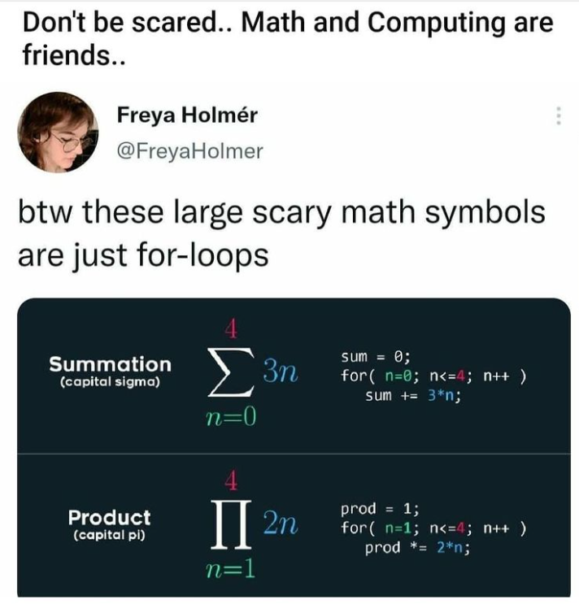

# Vorkurs Informatik

Herzlich Willkommen beim Vorkurs Informatik. Sie finden hier alle Informationen zu der Vorlesung und der Übung.

## Vorlesung 
Die Vorlesung findet vom 04.10.2023 - 13.10.2023 von 10:15 - 11:45 im [Hörsaal Bachstraße 18k](https://friedolin.uni-jena.de/qisserver/rds?state=verpublish&publishContainer=roomContainer&publishid=26863&zoom=y) statt.

## Übung
Die Übung ist in fünf Gruppen aufgeteilt. Diese finden von 12:00-13:30, 13:30-15:00 im [Kompetenz- und Servicezentrum](https://friedolin.un'i-jena.de/qisserver/rds?state=verpublish&status=init&vmfile=no&moduleCall=webInfo&publishConfFile=webInfoEinrichtung&publishSubDir=einrichtung&keep=y&einrichtung.eid=60011) statt. 

Die Übungsserien werden als Jupyter Notebook verfügbar sein. 

Die Gruppen werden wie folgt eingeteilt:
* 12:00 - 13:30 (Linux Pool 2): Informatik B.Sc. (A - M)
* 12:00 - 13:30 (Linux Pool 2): Informatik B.Sc. (N - Z)
* 12:00 - 13:30 (Windows Pool 1): Lehramt
* 13:30 - 15:00 (Linux Pool 2): Angewandte Informatik B.Sc.
* 13:30 - 15:00 (Linux Pool 1): Bioinformatik B.Sc.

## Diverse Links und Materialien
* Bitte füllen Sie folgenden Fragebogen zum Studienstart https://forms.gle/YA1T1aSWXthttYy86 aus
* Einen guten Einstieg in __Git__ findet man unter https://rogerdudler.github.io/git-guide/index.de.html
* Ein gutes Buch für das gesamte Studium ist __Mathematik für Informatiker__ von Teschl und Teschl (ISBN 978-3-642-37971-0). Hiervon gibt es zwei Teile. Beide sind sehr gut für die ersten Semester geeignet.

